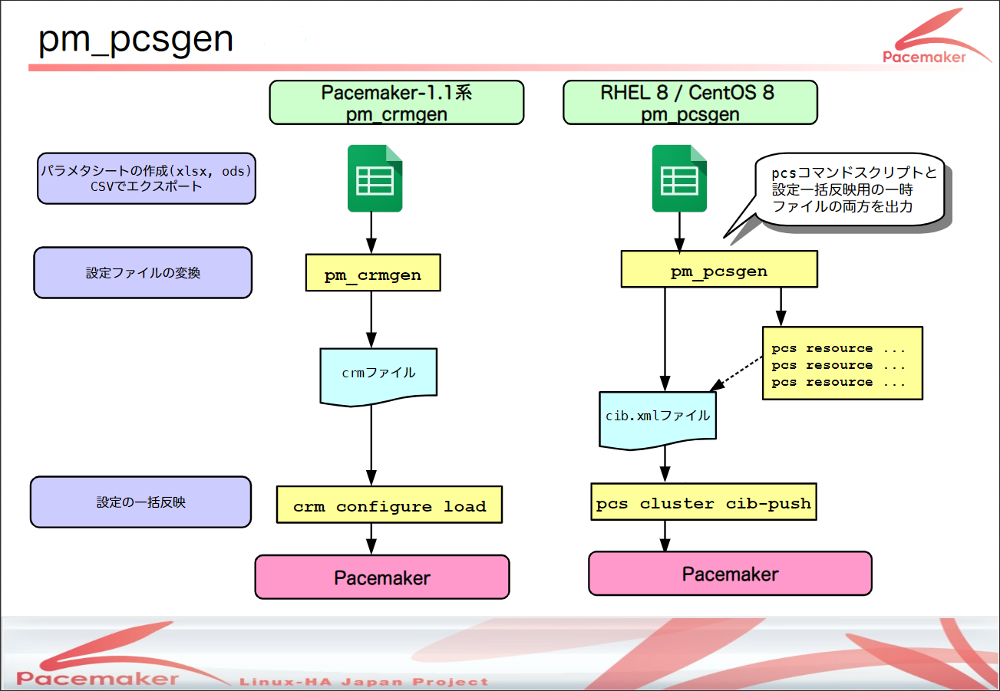

(Japanese)

# pm_extra_tools: Pacemaker-2.0系追加パッケージ

Copyright (c) 2020 Linux-HA Japan Project

## はじめに
Pacemaker-2.0系追加パッケージは、RHEL 8 High Availability Add-On (以下 HA Add-On) と組み合わせて利用する追加のツールです。
#### パッケージ内容
* 本パッケージには、以下のツールとリソースエージェントが含まれています。

1. [pm_pcsgen](#1-pm_pcsgen): Pacemaker-2.0系pcs設定変換ツール
2. [pgsql](#2-pgsql): PostgreSQL管理用のリソースエージェント
3. [hulft](#3-hulft): HULFT管理用のリソースエージェント

## 動作条件・バージョン
* 現時点のPacemaker-2.0系追加パッケージの最新バージョンは、pm_extra_tools-1.0-1 です。
* 動作を確認しているOS・バージョンは、RHEL 8.1 HA Add-On / CentOS 8.1911 です。
#### 既知の制約事項
* pm_extra_tools-1.0-1
  * pgsql: RHEL 8.2 HA Add-On の組み合わせでは、レプリケーション機能(PG-REX構成)が正しく動作しません。

## インストール・アンインストール
* インストール手順

  ```
  # dnf install pm_extra_tools-<ver>.el8.noarch.rpm -y
    ： (省略)

  インストール済み:
    pm_extra_tools-<ver>.el8.noarch

  完了しました!
  ```

* アンインストール手順

  ```
  # dnf erase pm_extra_tools -y
    ： (省略)

  削除しました:
    pm_extra_tools-<ver>.el8.noarch

  完了しました!
  ```

## 使い方詳細
#### 1. pm_pcsgen
Pacemaker-2.0系クラスタ構成の設定ファイルを作成するツールです。

* pm_crmgen(Pacemaker-1.1系crm設定変換ツール)のpcs対応版です。

  <details><summary>設定変換ツールの概要</summary><div>

  
  </div></details>

##### インストールされるファイル
* /usr/bin/**pm_pcsgen**
  * パラメータシートから「設定一括反映用ファイル(.xml)」と「pcsコマンドスクリプト(.sh)」を作成するコマンドです。
* /usr/share/pm_extra_tools/**pm_pcsgen_sample.xlsx**
  * パラメータシートのサンプルです。<br>「PostgreSQL共有ディスク構成」と「PG-REX構成」の設定例を記載しています。
* /usr/share/pm_extra_tools/pm_pcsgen.conf
  * pcsコマンドの出力メッセージのフィルタリング条件を設定したファイルです。
    * pm_pcsgenコマンドは内部でpcsコマンドを実行しますが、<br>pcsコマンドはユーザには不要なメッセージを出力することがあります。<br>pm_pcsgenではこの設定ファイルを基に必要なメッセージのみを出力します。
  * 変更は不要です。

##### 使い方
* (1) パラメータシートにクラスタ構成の設定を行い、CSVにエクスポートします。
  * Windows® operating system上でエクスポートしたCSVは、pm_pcsgenコマンドを実行するノードに転送します。
* (2) pm_pcsgenコマンドを実行し、CSVから設定一括反映用ファイルを作成します。
* (3) クラスタに設定を加えている(リソースなどが設定されている)場合は、クラスタを再構築します。
* (4) クラスタを起動します。
* (5) クラスタに設定を反映します(設定一括反映用ファイルをプッシュします)。

  ```
  (2)
  # pm_pcsgen pgsql-ipmi.csv
  pgsql-ipmi.xml (CIB), pgsql-ipmi.sh (PCS) を出力しました

  # ls -l
  -rw-r--r--.  1 root root     9449  3月 30 16:00 pgsql-ipmi.csv
  -rwxr--r--.  1 root root     3586  3月 30 16:01 pgsql-ipmi.sh
  -rw-r--r--.  1 root root    10527  3月 30 16:01 pgsql-ipmi.xml

  (3)
  # pcs cluster destroy --all
  # pcs cluster setup ...

  (4)
  # pcs cluster start --all

  (5)
  # pcs cluster cib-push pgsql-ipmi.csv
  ```
  </div></details>

##### pm_pcsgenコマンドの返り値
* 返り値を以下に示します。

  |返り値 |意味 |
  |:---:|---|
  | 0 | 正常終了 |
  | 1 | 異常終了 |
  | 2 | 警告つき正常終了 (.xmlと.shの出力は完了。ただし処理中に警告が発生) |

##### 制限事項
###### pm_pcsgenコマンド
* 実行環境にはクラスタパッケージをインストールしている必要があります。(pacemakerとpcsは必須)
* 「表1-1 NODE表」に値を設定した場合は、実行環境でクラスタが起動している必要があります。<br>
###### パラメータシート
* 設定値の制約を以下に示します。

  |表番 |表名 |列名 |設定可能な値 |
  |:---:|---|---|---|
  | 1-1 | NODE | type | attribute \| utilization |
  | 4-1 | RESOURCES | resourceItem | Primitive \| Stonith \| Group \| **Clone</u> \| Promotable** |
  | | | id | resourceItemの値が **Clone または Promotable** の場合 :<br>・```<Clone対象のリソースID>```＋```-clone```<br>・```<Promotable対象のリソースID>```＋```-clone``` |
  | 7-1 | PRIMITIVE | class<br>provider<br>type <sup>[※1](#note1)</sup> | それぞれ以下のコマンドで確認できます。<br>```# pcs resource standards```<br>```# pcs resource providers```<br>```# pcs resource agents [standard[:provider]]``` |
  | | | type <sup>[※2](#note2)</sup> | options \| meta \| utilization |
  | 8-1 | STONITH | type <sup>[※1](#note1)</sup> | 以下のコマンドで確認できます。<br>```# pcs stonith list``` |
  | | | type <sup>[※2](#note2)</sup> | options \| meta \| utilization |
  | 9-1 | LOCATION_NODE | prefers/avoids | prefers \| avoids |
  | 11-1 | ORDER | kind | Optional \| Mandatory \| Serialize |
  | 12-1 | ALERT | type | options \| meta |
  * <div id="note1">※1 「リソースエージェント名」、「STONITHエージェント名」を設定する項目</div><div id="note2">※2 「パラメータ種別」を設定する項目</div>

* 設定値(パラメータシートの青枠内)には、半角英数字以外の文字を使用しないこと。<br>概要欄・備考欄には、Shift-JISの拡張文字(①、②・・・、I、II・・・など)を使用しないこと。

#### 2. pgsql
PostgreSQL 12 及び PG-REX(レプリケーション) に対応した、PostgreSQL管理用のリソースエージェントです。<br>開発コミュニティ([https://github.com/ClusterLabs/resource-agents](https://github.com/ClusterLabs/resource-agents))の最新の修正に追随しています。

* 使用するには provider部分に**linuxhajp**、type部分に**pgsql** を設定します。
* 設定パラメータについては、RAのメタデータを参照してください。(```# pcs resource describe ocf:linuxhajp:pgsql```コマンドで確認できます。)

#### 3. hulft
HULFTの 配信デーモン(hulsndd) / 集信デーモン(hulrcvd) / 要求受付デーモン(hulobsd) 管理用のリソースエージェントです。

* 使用するには provider部分に**linuxhajp**、type部分に**hulft** を設定します。
* 設定パラメータについては、RAのメタデータを参照してください。(```# pcs resource describe ocf:linuxhajp:hulft```コマンドで確認できます。)

## 補足事項
#### クラスタの構築手順などはこちらの資料を参照ください。
* [Linux-HA Japan プロジェクト](https://linux-ha.osdn.jp/wp/) > [OSC2020 Tokyo/Spring セミナー資料](https://linux-ha.osdn.jp/wp/archives/4942)
* [ClusterLabs website > Pacemaker Documentation](https://clusterlabs.org/pacemaker/doc/)
<br>
以上
